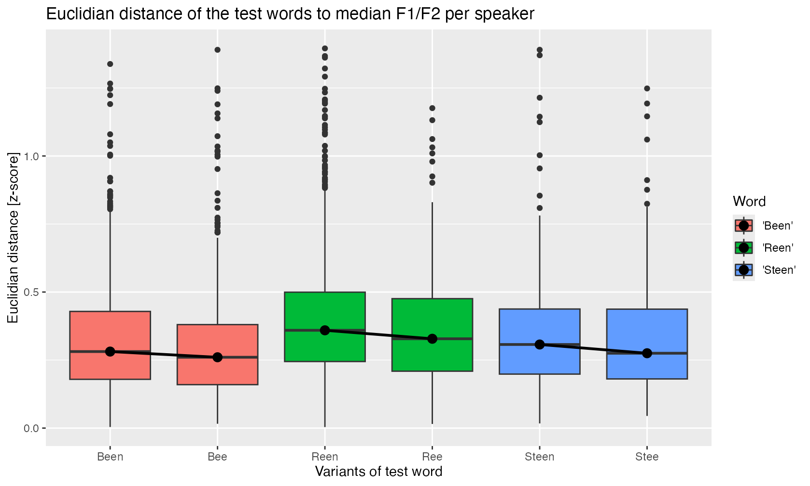

# Introduction

Being part of a complex prosodic phenomenon, word-final
alveolar nasals are deleted in Central Franconian dialects
according to a set of phonological characteristics of the
word itself, including the vowel preceding /n/, and the
following context ('Word-final *n* deletion', WFnD). These
intricacies and and their analysis within the theoretical
framework of the ‘Life cycle of phonological processes’ are
the topic of our article "The unfolding of word-final /n/
deletion in Central Franconian dialects. Where internal,
geographical, and diachronic factors meet" (in prep.). In
this article, we argue that after deletion the nasal is
entirely deleted without a trace in the word (e.g.
influencing the preceding vowel quality). Thus, WFnD is
regarded as an abrupt and hence phonological process (as
opposed to a phonetically continuous process).

To corroborate our claim, the following documentation is
intended to present some examples and acoustic analysis for
this aspect of WFnD. First, audio examples for words from
the dialect of Ubach over Worms (UoW) are presented
alongside with their acoustic representations
(segment-aligned waveform and spectrogram). A second,
acoustic analysis of crowd-sourced data for Luxembourgish is
meant to establish whether there are any differences in
quality of the preceding vowel between words in which the
following nasal is deleted and words in which it is
retained.

# Audio examples for the dialect of Ubach over Worms

In the UoW dialect, depending on the lexical word class,
WFnD can apply either obligatory or variably, or is entirely
blocked. The following examples serve as illustrations for
these cases.

1.  **WFnD is obligatory**

The morpheme *-ən* (in verbs, nouns and adjectives - here as
plural ending in the equivalent of the verb form *make*
’make’) has lost its final *-n*, which formerly was part of
the infinitve ending *-en*.

{width="60%"} <audio controls>
<source src="01.wav" type="audio/wav"> Your browser does not
support the audio element. </audio>

2.  **WFnD is blocked**

By contrast, in the verbal imperative *re2əkən* ‘calculate!’
the deletion is blocked because this *-n* forms part of the
verb stem and (the infinitive is *re2əkənən)*.

{width="60%"} <audio controls>
<source src="02.wav" type="audio/wav"> Your browser does not
support the audio element. </audio>

3.  ***WFnD*** **is obligatory**

Similar to 1., the nasal in *a2* (\< *a2n* 'to') is lost.

{width="60%"} <audio controls>
<source src="03.wav" type="audio/wav"> Your browser does not
support the audio element. </audio>

4.  **WFnDis blocked**

Similar to 1., WFnD is blocked in *haː1n* 'rooster' as the
nasal is part of the stem of the noun.

{width="60%"} <audio controls>
<source src="04.wav" type="audio/wav"> Your browser does not
support the audio element. </audio>

5.  **WFnD is variable**

This and all the following instances allow a consistent
investigation into the potential consequences of deletion,
as the same word variably can undergo deletion or retention
of the nasal (quasi as a minimal pair). In this example, the
nasal in *bɪn* '(I) am' is retained.

{width="60%"} <audio controls>
<source src="05.wav" type="audio/wav"> Your browser does not
support the audio element. </audio>

6.  **WFnD is variable**

Here the same word *bɪn* is undergoing deletion (*bɪ\_)*.
According to the auditory control and comparison of the
formant structure in the spetrogram, there is clearly no
phonetic residual of the nasal and the quality of the
preceding vowel is also fairly identical in *bɪn* and
*bɪ\_.* These observations support our claim that the nasal
is in fact deleted without a trace.

{width="60%"} <audio controls>
<source src="06.wav" type="audio/wav"> Your browser does not
support the audio element. </audio>

The same is true for all of the following word-pairs 7.-14.
(*hɑn/hɑ\_, vɑn/vɑ\_, kʀɪn/kʀɪ, ʃtɔ̝n/ʃtɔ̝)*: The auditory and
acoustic inspection confirms that the nasal is deleted
without exercising a noticeable influence on the preceding
vowel.

7.  **WFnD is variable**

{width="60%"} <audio controls>
<source src="07.wav" type="audio/wav"> Your browser does not
support the audio element. </audio>

8.  **WFnD is variable**

{width="60%"} <audio controls>
<source src="08.wav" type="audio/wav"> Your browser does not
support the audio element. </audio>

9.  **WFnD is variable**

{width="60%"} <audio controls>
<source src="09.wav" type="audio/wav"> Your browser does not
support the audio element. </audio>

10. **WFnD is variable**

{width="60%"} <audio controls>
<source src="10.wav" type="audio/wav"> Your browser does not
support the audio element. </audio>

11. **WFnD is variable**

{width="60%"} <audio controls>
<source src="11.wav" type="audio/wav"> Your browser does not
support the audio element. </audio>

12. **WFnD is variable**

{width="60%"} <audio controls>
<source src="12.wav" type="audio/wav"> Your browser does not
support the audio element. </audio>

13. **WFnD is variable**

{width="60%"} <audio controls>
<source src="13.wav" type="audio/wav"> Your browser does not
support the audio element. </audio>

14. **WFnD is variable**

{width="60%"} <audio controls>
<source src="14.wav" type="audio/wav"> Your browser does not
support the audio element. </audio>

# Acoustic analysis of vowel quality in WFnD in Luxembourgish

In order to investigate the potential impact of deletion on
the preceding vowel, this following analysis will
concentrate on a formant analysis of this vowel: If the
non-presence of the nasal has an impact on the quality of
the preceding vowel, then one has to still to assume that
WFnD is (also) a gradient and hence phonetic process. By
contrast, on the other hand, if the vowel quality remains
unaffected after application of WFnD, then the deletion can
actually by regarded as a phonetically abrupt, and thus a
phonological process.

This analysis will be conducted for comparable words of
Luxembourgish, where WFnD is variable after a long vowel
(context {VVn~1~}): In words like *Steen* 'stone', *Reen*
'rain' and *Been* 'leg' the final nasal is allophonically
deleted or retained. The vowel quality for [eː] thus will be
measured for instances for *Steen, Reen, Been* and also for
*Stee\_, Ree\_, Bee\_.* These values then will also be
compared with the vowel quality of [eː] in other words of
Luxembourgish (e.g. *Beem* 'trees', *See* 'saw' etc.). The
data comes from a large crowd-sourced corpus of
Luxembourgish (@entringer2021, @gilles2023), which has been
automatically transcribed with an ASR system
(@gillesLUXASRBuildingASR2023). In the analysis, data from
1574 different speakers have been taken into account. After
eliminating outliers (using the Mahalanobis method, cf.
@joeyr), 2575 instances of the relevant words with or
without final -n, as well as 35627 other content words
containing also the vowel [eː], were subjected to the
formant analysis.

+------+------+
| Word | n    |
+======+=====:+
| Been | 728  |
+------+------+
| Bee  | 514  |
+------+------+
| Reen | 932  |
+------+------+
| Ree  | 142  |
+------+------+
| S    | 127  |
| teen |      |
+------+------+
| Stee | 132  |
+------+------+
| r    | 33   |
| emai | 053  |
| ning |      |
| cont |      |
| ent\ |      |
| w    |      |
| ords |      |
| with |      |
| [eː] |      |
+------+------+
| *    | **3  |
| *TOT | 562  |
| AL** | 7**  |
+------+------+

: Data set for the vowel quality study.

For every instance of [eː] the values of F1 and F2 have been
measured automatically at the temporal midpoint. To be able
to compare the formant values of speakers directly, the
values have been normalised using the Lobanov method (to be
precise, the Lobanov_2 normalisation proposed by
@brandSystematicCovariationMonophthongs2021).

The following F1/F2 plot shows the mean formant frequencies
per speaker for the three target words either with -n
retained (left) or deleted (right). From the pairwise visual
inspection of the two clouds of realisations it is obvious
that the vowel realisations are rather similar, if not
identical.

However, in this
visualisation it is not possible to identify the degree of
similarity on the basis of the individual speaker. To
further refine the analysis, the acoustic distance between
the variants with and without -n, respectively, and the
individual median values of the remaining eː-realisations
are calculated using the Euclidian distance.

The following boxplots show the variation of all these
distances, e.g., the first boxplot shows that the individual
median Euclidian distances between the [eː] in *Been* and
the median of all other [eː] lies around 0.3 units on the
Lobanov scale. The variational range of the first and the
second boxplot overlap to a large extent, indicating that
the individual distances of the [eː] in *Bee* to the median
of all other [eː] is similar.

While the difference
between the words with and without final nasal is rather
small (reconverted to the frequency scale in the order of \~
50 Hz), a pattern regarding retention and deletion of the
nasal emerges for the three words: It seems that the average
distance of the variant with deletion is closer to the
median of the remaining [eː] realisations and that thus the
variant with nasal is further away from this median.

In order to test if the distances for the two conditions are
actually statistically different, a Welch two sample t-test
has been conducted. The results in the following table
confirm that there is actually no statistically significant
difference between the distance of [eː] in *Been* or *Bee,
Reen* or *Ree, Steen* or *Stee* compared to the other [eː]
realisations.

+-----------+-----------+-----------+-----------+
| word pair | test      | p-value   | c         |
|           | statistic |           | onfidence |
|           |           |           | interval  |
+===========+===========+===========+===========+
| Been \~   | t         | 0.122     | CI =      |
| Bee       | (1099.98) |           | [−0.005,  |
|           | = 1.55    |           | 0.043]    |
+-----------+-----------+-----------+-----------+
| Reen \~   | t(253) =  | 0.475     | CI =      |
| Ree       | 0,715     |           | [−0.0386, |
|           |           |           | 0.0827]   |
+-----------+-----------+-----------+-----------+
| Steen \~  | t(183) =  | 0.1206    | CI =      |
| Stee      | 1.5593    |           | [−0.0089, |
|           |           |           | 0.07608]  |
+-----------+-----------+-----------+-----------+

# Conclusion

The auditory and acoustic analyses presented here shed some
light on the phonetic and phonological status of word-final
n-deletion in Central Franconian, illustrated for the
varieties of Ubach over Worms and Luxembourg. The various
analyses support our claim that the deletion of the final
nasal is a phonetically abrupt process, - at least with
regard to its potential influence on the preceding vowel: It
was so far not possible to detect any clear evidence that
the presence or absence of the final nasal is reflected
systematically in the quality of the preceding vowel. Note
that further studies are still needed to determine the
amount of vowel nasalisation and if this nasalisation stays
also after the deletion of the nasal.

# Bibliography
